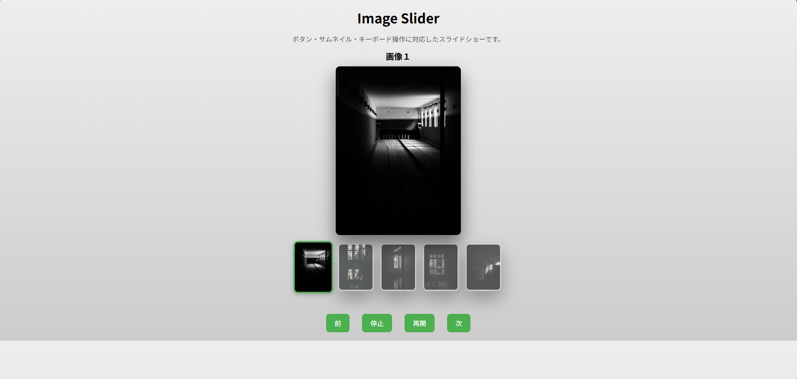

# image-slider
ボタン・サムネイル・キーボード操作対応のスライドショーです。

## Demo

## 機能
- 次へ/前へボタンで操作
- 自動再生・停止機能
- サムネイルクリックで画像切り替え
- キーボード操作対応
- CSSのopacityとtransitionをつかったフェードアニメーション

## 使用技術
- HTML
- CSS
- JavaScript

## 工夫した点
- 無限ループスライドの実装
- フェード切り替えによるUX向上
- 状態管理（current index）による制御
